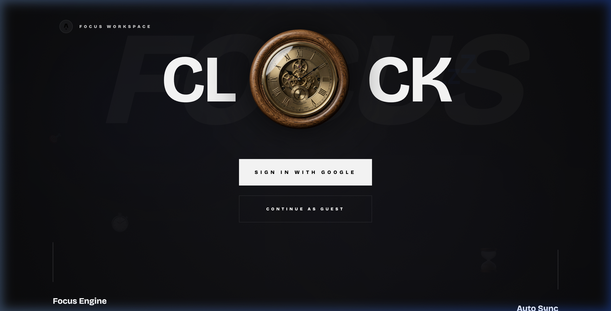
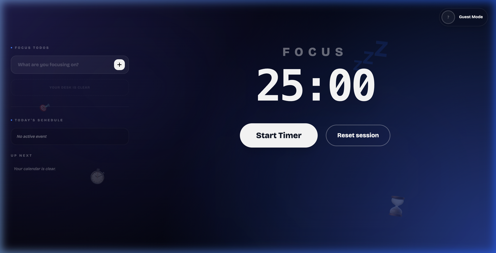
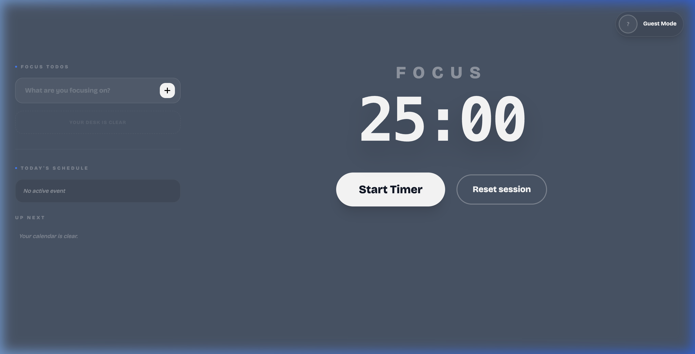

# Focus Workspace - Mechanical Pomodoro

Focus Workspace is a refined, mechanical-themed Pomodoro timer designed for deep work. It seamlessly integrates with your **Google Calendar** to automatically setup your focus sessions based on your daily schedule.



## ✨ Features

- 🔄 **Auto Sync**: Automatically structure your Pomodoro sessions based on your Google Calendar events.
- 🕰️ **Mechanical Aesthetic**: A premium, high-fidelity UI with immersive animations and soundscapes.
- 🎨 **Multiple Themes**:
    - **Immersive**: Deep gradients and atmospheric depth.
    - **Minimal**: Clean, high-contrast focus.
- 👥 **Guest Mode**: Start focusing immediately without an account.
- ✅ **Task Management**: Keep track of manual todos alongside your calendar schedule.
- 🔔 **Smart Alerts**: Interactive "Still there?" presence checks to keep you on track.

## 🖼️ Themes

| Immersive | Minimal |
| :---: | :---: |
|  |  |

---

## 🚀 Setup Instructions

### 1. Prerequisites
- [Node.js](https://nodejs.org/) (v18+)
- [pnpm](https://pnpm.io/) (recommended)

### 2. Installation
```bash
git clone <your-repo-url>
cd pomodoro-calendar
pnpm install
```

### 3. Firebase Setup
To enable authentication and data sync, you need a Firebase project:

1.  Go to the [Firebase Console](https://console.firebase.google.com/).
2.  Create a new project named `Focus Workspace`.
3.  **Authentication**: Enable **Google** sign-in provider.
4.  **Firestore Database**: Create a database in **Production Mode** (or test mode, but update rules later).
5.  **Project Settings**: Add a "Web App" and copy the `firebaseConfig` keys.

### 4. Google Calendar API Setup
1.  Go to the [Google Cloud Console](https://console.cloud.google.com/).
2.  Select your Firebase project.
3.  Enable the **Google Calendar API**.
4.  Configure the **OAuth consent screen** and add the following scopes:
    - `https://www.googleapis.com/auth/calendar.readonly`
    - `https://www.googleapis.com/auth/calendar.events.readonly`

### 5. Environment Variables
Create a `.env` file in the root directory and fill in your Firebase credentials:

```env
PUBLIC_FIREBASE_API_KEY=your_api_key
PUBLIC_FIREBASE_AUTH_DOMAIN=your_project.firebaseapp.com
PUBLIC_FIREBASE_PROJECT_ID=your_project_id
PUBLIC_FIREBASE_STORAGE_BUCKET=your_project.appspot.com
PUBLIC_FIREBASE_MESSAGING_SENDER_ID=your_sender_id
PUBLIC_FIREBASE_APP_ID=your_app_id
PUBLIC_FIREBASE_MEASUREMENT_ID=your_measurement_id
```

### 6. Run the App
```bash
pnpm dev
```
Open [http://localhost:4321](http://localhost:4321) in your browser.

---

## 🛠️ Tech Stack
- **Framework**: [Astro](https://astro.build/)
- **UI Architecture**: React + [Nanostores](https://github.com/nanostores/nanostores)
- **Styling**: TailwindCSS
- **Backend**: Firebase (Auth & Firestore)
- **Calendar**: Google Calendar API

## 📝 License
Built with ❤️ by Aayush Sapkota. Licensed under [GNU GPLv3](./LICENSE).
